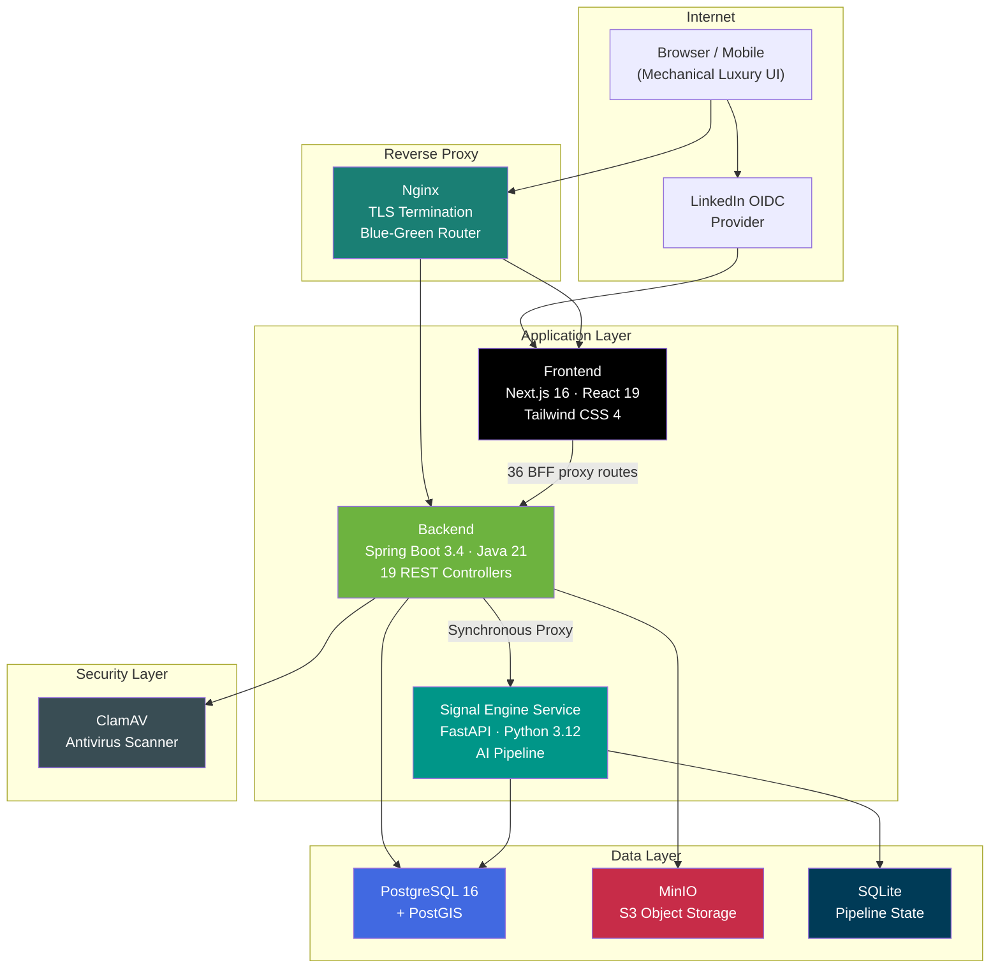

<p align="center">
  
</p>

<h1 align="center">Leyoda</h1>

<p align="center">
  <strong>AI-powered investor–startup matching platform for the European venture ecosystem.</strong><br/>
  Swipe-based discovery • Structured profiles • AI signal intelligence • Enterprise-grade infrastructure
</p>

<p align="center">
  
  
  
  
  
  
  
  
</p>

---

> **📋 Case Study** — This repository is a technical case study. Source code is proprietary and not included. The documentation below showcases the architecture, engineering decisions, and technical depth of the platform.

---

## Table of Contents

- [Overview](#overview)
- [Architecture](#architecture)
- [Tech Stack](#tech-stack)
- [Services & Components](#services--components)
- [Engineering Highlights](#engineering-highlights)
- [Security Design](#security-design)
- [Testing Strategy](#testing-strategy)
- [Project Scale](#project-scale)
- [Screenshots](#screenshots)
- [Author](#author)

---

## Overview

Leyoda is a full-stack, production-grade platform that connects investors with early-stage startups across Europe. It combines a **swipe-based discovery engine** with structured startup profiles and real-time analytics to streamline the fundraising lifecycle.

The European early-stage investment landscape is fragmented and opaque — founders spend months cold-emailing investors with no signal on fit, while investors sift through thousands of unqualified decks. Leyoda replaces the noise with structured, card-based profiles where both sides evaluate fit through traction data, sectors, check sizes, and geography — then match with a single swipe.

What makes it technically interesting:

- A **6-stage AI intelligence pipeline** (Signal Engine) that transforms university research papers into ranked, investment-grade startup concepts
- **Security-hardened two-phase authentication** with OpenID Connect (LinkedIn) and intelligent redirection
- **Decoupled enterprise-grade blue-green deployments** spanning multiple repositories with zero-downtime hotswapping and automated rollback
- **Industrial-grade verification framework** featuring over 13,000 lines of test code, singleton testcontainers, and adversarial E2E validation
- **Three-tier input validation** spanning frontend schemas, pre-submission guards, and backend annotations

---

## Architecture



### Service Dependency Chain

Services follow a strict healthcheck policy — nothing starts until its dependencies report healthy. Cross-service domain separation guarantees Zero Trust machine identity for internal communications:

```text
Frontend  →  Backend  →  Database (PostgreSQL)
                      →  MinIO (Object Storage)
                      →  ClamAV (Antivirus)
                      →  Signal Engine (AI Pipeline)
```

---

## Tech Stack

### Backend

| Layer | Technology | Why |
|:------|:-----------|:----|
| **Runtime** | Java 21 | Modern LTS with virtual threads support |
| **Framework** | Spring Boot 3.4 | REST API, dependency injection, security, data access |
| **ORM** | Hibernate 6 + Spring Data JPA | Type-safe data access with spatial extensions |
| **Database** | PostgreSQL 16 + PostGIS | Relational storage with geo-spatial query support |
| **Migrations** | Flyway | 41 versioned, repeatable schema migrations |
| **Auth** | Spring Security + JWT (HS256) | Stateless auth via HttpOnly cookies; Hardened request matchers |
| **OAuth** | LinkedIn (OIDC) · X (Twitter OAuth 2.0) | Social sign-in with intelligent redirection and mandatory profile setup |
| **Storage** | MinIO (S3-compatible) | Owner-isolated binary asset management |
| **Antivirus** | ClamAV | File upload scanning before persistence |
| **Rate Limiting** | Bucket4j | In-memory token bucket algorithm |

### Frontend

| Layer | Technology | Why |
|:------|:-----------|:----|
| **Framework** | Next.js 16 (App Router) | SSR, ISR, API routes, middleware |
| **UI** | React 19 | Server Components, concurrent features |
| **Styling** | Tailwind CSS 4 | Utility-first CSS with custom design tokens for "Mechanical Luxury" aesthetics |
| **Components** | shadcn/ui + Radix | Accessible, headless component primitives with zero-latency tactile feedback |
| **Forms** | React Hook Form + Zod | Performant forms with schema validation |
| **Data Fetching** | SWR | Stale-while-revalidate caching strategy |
| **Linting** | Biome | Unified lint and format (replaces ESLint + Prettier) |

### Signal Engine (AI Pipeline)

| Layer | Technology | Why |
|:------|:-----------|:----|
| **Runtime** | Python 3.12 | AI/ML pipeline execution |
| **API** | FastAPI + Uvicorn | Async REST API for pipeline orchestration |
| **Orchestration** | Trajector | 6-stage structured forward-looking signal extraction |
| **Embeddings** | sentence-transformers (all-MiniLM-L6-v2) | 384-dim vectors for semantic clustering (CPU) |
| **PDF Parsing** | PyMuPDF · pypdf | Scientific paper text extraction |
| **Pipeline State** | SQLite (WAL mode) | Checkpoint/resume for long-running pipelines |

### Infrastructure

| Layer | Technology | Why |
|:------|:-----------|:----|
| **Orchestration** | Docker Compose | Multi-service local and production environment |
| **Reverse Proxy** | Nginx | TLS termination, routing, blue-green upstream switching |
| **Deployment** | Blue-Green + Zero-Downtime | Atomic switchover with health-check gating across decoupled repos |
| **Latency Mitigation** | Warm Sleep | Unified patterns to mitigate container cold-start delays |

---

## Services & Components

| Service | Responsibility |
|:--------|:--------------|
| **Backend** (Spring Boot) | 19 REST controllers, 22 business services, JWT auth, rate limiting, file validation, unified proxy for Signal Engine |
| **Frontend** (Next.js) | 113 TSX components, 36 BFF proxy routes, SSR, App Router, design system |
| **Signal Engine** (FastAPI) | Extracted standalone service; runs the 6-stage AI pipeline, venture memos, calendar CRUD, and pipeline status endpoints |
| **PostgreSQL + PostGIS** | Relational data store with geo-spatial extensions, 41 Flyway migrations including autonomous table management |
| **MinIO** | S3-compatible object storage with owner-based access isolation |
| **Nginx** | TLS termination, reverse proxy, blue-green upstream routing |

---

## Engineering Highlights

### 1. Industrial-Grade Verification Framework

The platform boasts a rigorous 209+ test suite comprising over 35,000 lines of test code. Testing goes far beyond standard unit coverage to encompass **adversarial E2E verification** (`verify_flow.ps1`) and contract testing for all components:

- **Singleton Testcontainers:** Database and external dependencies are managed as static singletons in tests, drastically cutting down context load times to achieve testing cadences upwards of 500+ LOC/hr during active hardening.
- **Mandatory Schema Validation:** Every payload across the frontend API, backend proxy, and Python Signal Engine bounds check inputs rigidly, ensuring no malformed requests permeate the execution context.
- **Contract & Gap Closure:** A specialized Feb 2026 test gap closure initiative fortified structural endpoints involving complex multi-step state mutations (like user invites joining companies). 

### 2. Security-Hardened Two-Phase Authentication

We built a complete OpenID Connect (OIDC) integration for LinkedIn, seamlessly bridged to a mandatory internal **Step 0 Profile Setup**:

- **Intelligent Redirection:** The OAuth callback handler correctly routes new vs. returning users. If a user authenticates via LinkedIn but lacks mandatory profile details (like a profile picture or role), they are gated inside the `Profile Setup` screen.
- **Strict Request Matchers:** The Spring Security firewall enforces strict filter ordering, rejecting unauthenticated traffic traversing Next.js BFF routes before processing user-specific controllers.
- **Zero-Latency UI:** The "Mechanical Luxury" frontend design language ensures immediate tactile feedback. Authentication transitions happen optimistically to prevent loading stutters.

### 3. Decoupled Enterprise-Grade Hotswap Deployments

The backend application and the Python-powered Signal Engine are decoupled into isolated CI/CD pipelines, yet both rely on enterprise-grade zero-downtime hotswapping:

1. **Independent Builds:** The Signal Engine natively builds on the VPS via specialized GitHub Actions to manage heavy PyTorch dependencies efficiently. 
2. **Container Hotswapping:** The deploy script bootstraps a new container via `docker compose --profile signal-engine pull && up -d --no-deps`.
3. **Rigorous Health Check:** The pipeline waits for up to 20 cycles against the `/health` REST endpoint of the newly spawned instance. If it drops connection or faults due to data-layer permissions, the pipeline triggers an automated instant rollback.
4. **Traffic Transition:** Once healthy, traffic seamlessly switches to the new container signature via native internal Docker routing, totally shielding the Next.js frontend and Spring backends from the transition.

### 4. Trajector — AI Signal Intelligence Pipeline

The Signal Engine powers Leyoda's deep tech discovery via a 6-stage pipeline:

```text
PDF Corpus → INGEST → EXTRACT → EMBED → CLUSTER → SYNTHESIZE → OUTPUT
  (PyMuPDF)  (chunks)  (signals) (vectors) (themes)  (opps)     (JSON/MD)
```

- **Ingest** — Extracts text from PDFs natively using PyMuPDF.
- **Extract** — LLMs extract forward-looking signals spanning emerging methods, translational cues, and unique assets.
- **Embed & Cluster** — Groups signals into thematic clusters via KMeans on L2-normalised `sentence-transformers` embeddings.
- **Synthesize** — Converts high-potential clusters into curated startup concept cards using extensive investability heuristics. Opportunities scoring below 40/100 are heavily discounted or dropped.
- **Proxy Serving** — The Python backend dynamically serves Dashboards, Venture Memos, and Pipeline Progress via Next.js fetching via the Java Backend. 

### 5. BFF Proxy Architecture

The frontend proxies **all** backend requests through 36 Next.js API routes (`/api/*`), hiding the internal backend URL entirely:

```text
Browser → Next.js BFF (/api/v1/*) → Spring Boot Backend (:8080/api/v1/*)
```

- JWT tokens are stored in **HttpOnly, Secure, SameSite** cookies — invisible to client-side JavaScript.
- Server-side cookie injection/extraction happens in the BFF layer.
- The browser never learns the backend URL — complete API isolation, eliminating common XSS-based token theft vectors and simplifying CORS configuration.

---

## Security Design

| Threat | Mitigation |
|:-------|:-----------|
| **Token theft (XSS)** | JWT stored in HttpOnly + Secure + SameSite cookies; BFF proxy hides tokens |
| **Machine Context Leaks** | Zero Trust Machine identity with domain cross-service separation |
| **Malware uploads** | ClamAV antivirus scan on every uploaded file before persistence to MinIO |
| **Unauthorised access** | Owner-based access control on MinIO; Strictly ordered Spring Security matchers |
| **CSRF** | SameSite cookie policy + CORS origin whitelisting |
| **API enumeration** | Backend URLs hidden behind Next.js BFF proxy; no direct browser→backend path |
| **Password reset abuse** | 32-byte `SecureRandom` tokens, 1-hour TTL, single active token per user |
| **Invalid data injection** | 3-tier validation: Zod (frontend) → pre-submission guard → JSR-303 (backend) |

---

## Testing Strategy

| Category | Framework | Scope |
|:---------|:----------|:------|
| **Unit Tests** | JUnit 5 + Mockito | Service layer logic, JWT provider, rate limiting, file validation |
| **Integration Tests** | Spring Boot Test + Testcontainers | Full controller→service→DB flows with real PostgreSQL in Singleton scale |
| **Adversarial E2E** | PowerShell | Custom `verify_flow.ps1` to stress test edge authentication parameters |
| **API Tests** | pytest + FastAPI TestClient | Signal Engine endpoints, pipeline stages, health probes |
| **Frontend Validation** | Biome + TypeScript strict mode | Static analysis, lint, type-check, build validation |
| **CI/CD** | GitHub Actions | Backend tests (Testcontainers), frontend lint + type-check + build on push |

---

## Project Scale

| Metric | Value |
|:-------|:------|
| **Application Services** | 4 (Backend, Frontend, Signal Engine, Nginx) |
| **Infrastructure Services** | 3 (PostgreSQL + PostGIS, MinIO, ClamAV) |
| **REST Controllers** | 19 |
| **Business Services** | 22 |
| **JPA Entities** | 15 entities + 21 enums |
| **Flyway Migrations** | 41 |
| **Frontend Components** | 113 TSX files |
| **BFF Proxy Routes** | 36 |
| **Signal Engine Modules** | 62 Python files |
| **Verification Fleet** | 209+ industrial-wide automated test files |
| **Test Code LOC** | 35,000+ lines defining rigorous schema/flow boundaries |
| **Docker Compose Profiles**| Advanced layered composability structure mapped to local/VPS targets |
| **CI/CD Workflows** | Decoupled cross-repo deployment automation mapping to singular domains |

---

## Author

**Alexandru Cioc**

- GitHub: [@WhitehatD](https://github.com/WhitehatD)
- Location: Maastricht, Netherlands

---

<p align="center">
  <sub>Built with ❤️ for the European startup ecosystem</sub>
</p>
