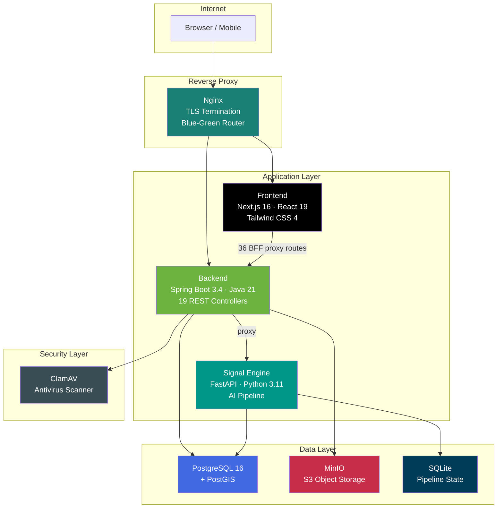
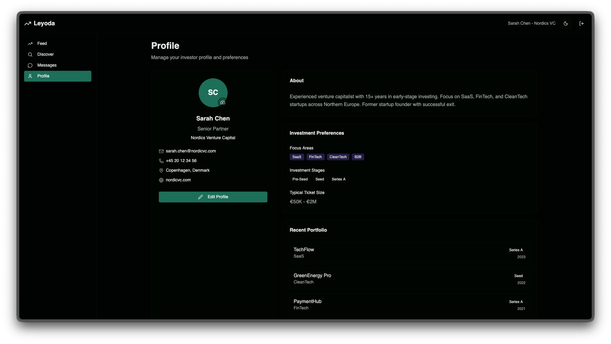
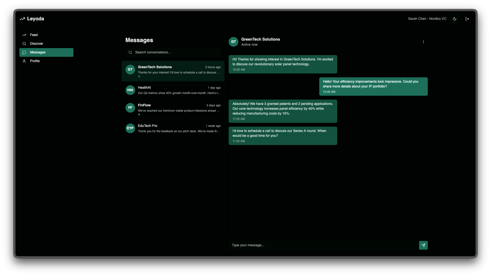
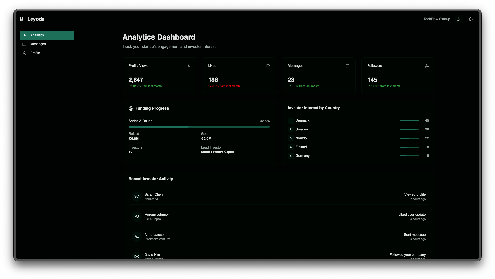
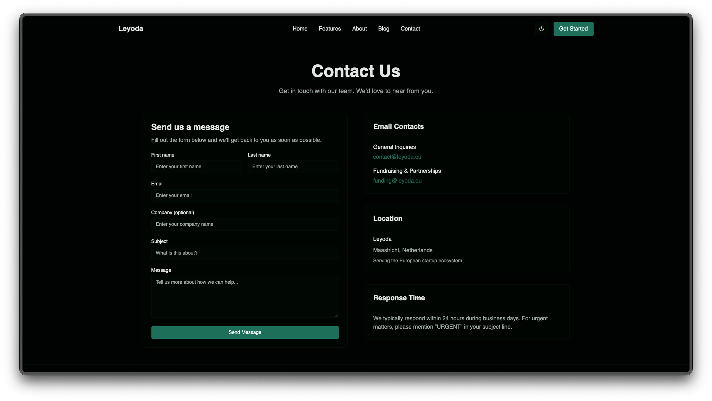
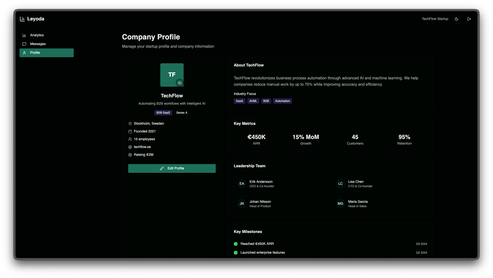
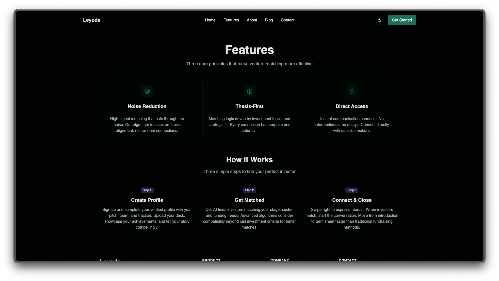

<p align="center">
  
</p>

<h1 align="center">Leyoda</h1>

<p align="center">
  <strong>AI-powered investor–startup matching platform for the European venture ecosystem.</strong><br/>
  Swipe-based discovery • Structured profiles • AI signal intelligence • Enterprise-grade infrastructure
</p>

<p align="center">
  
  
  
  
  
  
  
  
</p>

---

> **📋 Case Study** — This repository is a technical case study. Source code is proprietary and not included. The documentation below showcases the architecture, engineering decisions, and technical depth of the platform.

---

## Table of Contents

- [Overview](#overview)
- [Architecture](#architecture)
- [Tech Stack](#tech-stack)
- [Services & Components](#services--components)
- [Engineering Highlights](#engineering-highlights)
- [Security Design](#security-design)
- [Testing Strategy](#testing-strategy)
- [Project Scale](#project-scale)
- [Screenshots](#screenshots)
- [Author](#author)

---

## Overview

Leyoda is a full-stack, production-grade platform that connects investors with early-stage startups across Europe. It combines a **swipe-based discovery engine** with structured startup profiles and real-time analytics to streamline the fundraising lifecycle.

The European early-stage investment landscape is fragmented and opaque — founders spend months cold-emailing investors with no signal on fit, while investors sift through thousands of unqualified decks. Leyoda replaces the noise with structured, card-based profiles where both sides evaluate fit through traction data, sectors, check sizes, and geography — then match with a single swipe.

What makes it technically interesting:

- A **6-stage AI intelligence pipeline** that transforms university research papers into ranked, investment-grade startup concepts
- **Blue-green zero-downtime deployment** with automated health-check gating and instant rollback
- **Three-tier input validation** spanning frontend schemas, pre-submission guards, and backend annotations
- A **BFF (Backend-for-Frontend) proxy** architecture that isolates all authentication handling server-side

---

## Architecture



### Service Dependency Chain

Services follow a strict healthcheck policy — nothing starts until its dependencies report healthy:

```text
Frontend  →  Backend  →  Database (PostgreSQL)
                     →  MinIO (Object Storage)
                     →  ClamAV (Antivirus)
                     →  Signal Engine (AI Pipeline)
```

### Blue-Green Deployment

Production runs a zero-downtime blue-green strategy. Two parallel application slots (Blue on ports `8080/3000`, Green on `8081/3001`) sit behind an Nginx upstream router. Deploys hot-swap traffic atomically with health-check gating and automatic rollback on failure.

---

## Tech Stack

### Backend

| Layer | Technology | Why |
|:------|:-----------|:----|
| **Runtime** | Java 21 | Modern LTS with virtual threads support |
| **Framework** | Spring Boot 3.4 | REST API, dependency injection, security, data access |
| **ORM** | Hibernate 6 + Spring Data JPA | Type-safe data access with spatial extensions |
| **Database** | PostgreSQL 16 + PostGIS | Relational storage with geo-spatial query support |
| **Migrations** | Flyway | 41 versioned, repeatable schema migrations |
| **Auth** | Spring Security + JWT (HS256) | Stateless auth via HttpOnly cookies |
| **OAuth** | LinkedIn (OIDC) · X (Twitter OAuth 2.0) | Social sign-in with profile prefilling |
| **Storage** | MinIO (S3-compatible) | Owner-isolated binary asset management |
| **Antivirus** | ClamAV | File upload scanning before persistence |
| **Email** | Mailgun (EU region) | Transactional email (waitlist, password reset) |
| **GeoIP** | MaxMind GeoLite2 | IP-based visitor geolocation for analytics |
| **Rate Limiting** | Bucket4j | In-memory token bucket algorithm |
| **DTO Mapping** | MapStruct | Compile-time type-safe object mapping |
| **API Docs** | Springdoc OpenAPI (Swagger) | Auto-generated REST API documentation |
| **Build** | Gradle (Kotlin DSL) | Dependency management with JaCoCo coverage |

### Frontend

| Layer | Technology | Why |
|:------|:-----------|:----|
| **Framework** | Next.js 16 (App Router) | SSR, ISR, API routes, middleware |
| **UI** | React 19 | Server Components, concurrent features |
| **Styling** | Tailwind CSS 4 | Utility-first CSS with custom design tokens |
| **Components** | shadcn/ui + Radix | Accessible, headless component primitives |
| **Forms** | React Hook Form + Zod | Performant forms with schema validation |
| **Data Fetching** | SWR | Stale-while-revalidate caching strategy |
| **Typography** | Inter · JetBrains Mono | Professional body text + monospaced data |
| **Linting** | Biome | Unified lint and format (replaces ESLint + Prettier) |

### Signal Engine (AI Pipeline)

| Layer | Technology | Why |
|:------|:-----------|:----|
| **Runtime** | Python 3.11 | AI/ML pipeline execution |
| **API** | FastAPI + Uvicorn | Async REST API for pipeline orchestration |
| **Signal Extraction** | OpenRouter LLMs | Structured forward-looking signal extraction from papers |
| **Embeddings** | sentence-transformers (all-MiniLM-L6-v2) | 384-dim vectors for semantic clustering (CPU) |
| **Clustering** | scikit-learn (KMeans) | Thematic signal grouping on L2-normalised embeddings |
| **PDF Parsing** | PyMuPDF · pypdf | Scientific paper text extraction |
| **Pipeline State** | SQLite (WAL mode) | Checkpoint/resume for long-running pipelines |
| **Patent Data** | Google BigQuery | 100M+ worldwide patent records |
| **Web Crawling** | aiohttp + BeautifulSoup | Async company intelligence gathering |

### Infrastructure

| Layer | Technology | Why |
|:------|:-----------|:----|
| **Orchestration** | Docker Compose | Multi-service local and production environment |
| **Reverse Proxy** | Nginx | TLS termination, routing, blue-green upstream switching |
| **Deployment** | Blue-Green + Zero-Downtime | Atomic switchover with health-check gating |
| **CI/CD** | GitHub Actions | Automated test + lint pipeline; manual-dispatch deploy |
| **Monitoring** | Spring Actuator | `/actuator/health` for readiness probes |
| **Container Network** | Docker bridge (isolated) | Internal-only communication between services |

---

## Services & Components

| Service | Responsibility |
|:--------|:--------------|
| **Backend** (Spring Boot) | 19 REST controllers, 22 business services, JWT auth, rate limiting, file validation, email, OAuth flows |
| **Frontend** (Next.js) | 113 TSX components, 36 BFF proxy routes, SSR, App Router, design system |
| **Signal Engine** (FastAPI) | 6-stage AI pipeline (Trajector), 4 data crawlers, BD intelligence generation, opportunity scoring |
| **PostgreSQL + PostGIS** | Relational data store with geo-spatial extensions, 41 Flyway migrations |
| **MinIO** | S3-compatible object storage with owner-based access isolation |
| **ClamAV** | Antivirus scanning for all user file uploads |
| **Nginx** | TLS termination, reverse proxy, blue-green upstream routing |

---

## Engineering Highlights

### 1. Swipe-to-Match Discovery Engine

The matching engine uses a card-based swipe interface with three engagement types — **Interested**, **Pass**, and **Follow**. The system supports asymmetric persona experiences:

- **Founders** see analytics on who viewed their profile, swipe rates, and engagement trends
- **Investors** browse a discovery feed of startup profiles filtered by sector, stage, and geography

The frontend implements 3D card stacking with drag-and-release gesture physics. The backend processes match events asynchronously and maintains a mutual-interest graph for bilateral matching.

### 2. Blue-Green Zero-Downtime Deployments

Production uses a custom blue-green orchestrator (`deploy-zero-downtime.sh`) that:

1. **Detects** the currently active slot (Blue or Green)
2. **Builds** the inactive slot with the latest code
3. **Starts** the new slot alongside the live one
4. **Health-checks** both backend (`/actuator/health`) and frontend endpoints
5. **Switches** Nginx upstream atomically — zero dropped requests
6. **Drains** and gracefully stops the old slot (30s grace period)

If health checks fail, the deploy aborts automatically and traffic continues flowing to the existing slot. Rollback is instant via `--rollback`. The CI/CD pipeline (GitHub Actions) runs backend tests with Testcontainers and frontend type-checks/linting on every push, with manual-dispatch deployment to production.

### 3. Trajector — AI Signal Intelligence Pipeline

The Signal Engine runs a 6-stage sequential pipeline called **Trajector** with checkpoint/resume support:

```text
PDF Corpus → INGEST → EXTRACT → EMBED → CLUSTER → SYNTHESIZE → OUTPUT
  (PyMuPDF)  (chunks)  (signals) (vectors) (themes)  (opps)     (JSON/MD)
```

- **Ingest** — Extracts text from PDFs, splits into overlapping 1,500-token chunks at sentence boundaries
- **Extract** — LLM extracts forward-looking signals across 8 taxonomic categories (emerging methods, unique assets, translational cues, etc.)
- **Embed** — Generates 384-dimensional dense vectors for semantic similarity
- **Cluster** — Groups signals into thematic clusters via KMeans on L2-normalised embeddings
- **Synthesize** — Converts high-potential clusters into scored startup concept cards using 15+ investability heuristics
- **Output** — Writes executive briefs, opportunity cards, and signal dashboards

Each opportunity is scored on a 0–100 weighted scale across 7 dimensions (Exit Viability 20%, Translational Proximity 20%, Defensibility 18%, Market Clarity 17%, Momentum 12%, Team Capability 8%, Timing 5%). Opportunities scoring below 40 are automatically rejected.

### 4. Three-Tier Input Validation

All user input passes through three independent validation layers:

| Tier | Technology | Where |
|:-----|:-----------|:------|
| **1. Schema** | Zod (TypeScript) | Frontend — compile-time type-safe schemas |
| **2. Pre-submission Guard** | Custom logic | Frontend — catches edge cases before network request |
| **3. Backend Annotations** | JSR-303 (Jakarta Validation) | Backend — server-side validation mirroring frontend schemas |

This ensures that no invalid data reaches the database regardless of how the API is called (browser, cURL, etc.) and provides instant user feedback during form interaction.

### 5. BFF Proxy Architecture

The frontend proxies **all** backend requests through 36 Next.js API routes (`/api/*`), hiding the internal backend URL entirely:

```text
Browser → Next.js BFF (/api/v1/*) → Spring Boot Backend (:8080/api/v1/*)
```

- JWT tokens are stored in **HttpOnly, Secure, SameSite** cookies — invisible to client-side JavaScript
- The browser never learns the backend URL — complete API isolation
- Server-side cookie injection/extraction happens in the BFF layer
- CORS policies on the backend only whitelist the internal Docker network

This eliminates common XSS-based token theft vectors and simplifies CORS configuration.

---

## Security Design

| Threat | Mitigation |
|:-------|:-----------|
| **Token theft (XSS)** | JWT stored in HttpOnly + Secure + SameSite cookies; BFF proxy hides tokens from JS |
| **Brute force auth** | Per-endpoint rate limiting — Login: 10/min, Register: 5/min, Default: 60/min (Bucket4j) |
| **Malware uploads** | ClamAV antivirus scan on every uploaded file before persistence to MinIO |
| **Unauthorised file access** | Owner-based access control on MinIO — users can only access their own uploads |
| **CSRF** | SameSite cookie policy + CORS origin whitelisting |
| **API enumeration** | Backend URLs hidden behind Next.js BFF proxy; no direct browser→backend path |
| **Password reset abuse** | 32-byte `SecureRandom` tokens, 1-hour TTL, single active token per user |
| **Invalid data injection** | 3-tier validation: Zod (frontend) → pre-submission guard → JSR-303 (backend) |

---

## Testing Strategy

| Category | Framework | Scope |
|:---------|:----------|:------|
| **Unit Tests** | JUnit 5 + Mockito | Service layer logic, JWT provider, rate limiting, file validation |
| **Integration Tests** | Spring Boot Test + Testcontainers | Full controller→service→DB flows with real PostgreSQL |
| **Security Tests** | Spring Security Test | Authentication/authorisation for protected endpoints |
| **Edge Case Tests** | JUnit 5 (dedicated `*EdgeCasesTest`) | Boundary conditions, error handling, concurrent access |
| **API Tests** | pytest + FastAPI TestClient | Signal Engine endpoints, pipeline stages |
| **Pipeline Tests** | pytest | Ingest, cluster, synthesize, cache, config, schemas |
| **Frontend Validation** | Biome + TypeScript strict mode | Static analysis, lint, type-check, build validation |
| **CI/CD** | GitHub Actions | Backend tests (Testcontainers), frontend lint + type-check + build on every push |

---

## Project Scale

| Metric | Value |
|:-------|:------|
| **Application Services** | 4 (Backend, Frontend, Signal Engine, Nginx) |
| **Infrastructure Services** | 3 (PostgreSQL + PostGIS, MinIO, ClamAV) |
| **REST Controllers** | 19 |
| **Business Services** | 22 |
| **JPA Entities** | 15 entities + 21 enums |
| **Flyway Migrations** | 41 |
| **Frontend Components** | 113 TSX files |
| **BFF Proxy Routes** | 36 |
| **Signal Engine Modules** | 62 Python files |
| **Backend Test Files** | 37 |
| **Signal Engine Test Files** | 10 |
| **Docker Compose Files** | 3 (base + blue + green overlays) |
| **CI/CD Workflows** | 2 (ci-cd + cleanup) |

---

## Screenshots

> All screenshots use demo data. No real user information is shown.

<p align="center">
  <strong>Investor Profile</strong><br/>
  
</p>

<p align="center">
  <strong>Messaging</strong><br/>
  
</p>

<p align="center">
  <strong>Founder Analytics Dashboard</strong><br/>
  
</p>

<p align="center">
  <strong>Contact Page</strong><br/>
  
</p>

<p align="center">
  <strong>Startup Profile Card</strong><br/>
  
</p>

<p align="center">
  <strong>Onboarding Flow</strong><br/>
  
</p>

---

## Author

**Alexandru Cioc**

- GitHub: [@WhitehatD](https://github.com/WhitehatD)
- University: Maastricht University / Fontys University of Applied Sciences
- Location: Maastricht, Netherlands

---

<p align="center">
  <sub>Built with ❤️ for the European startup ecosystem</sub>
</p>
